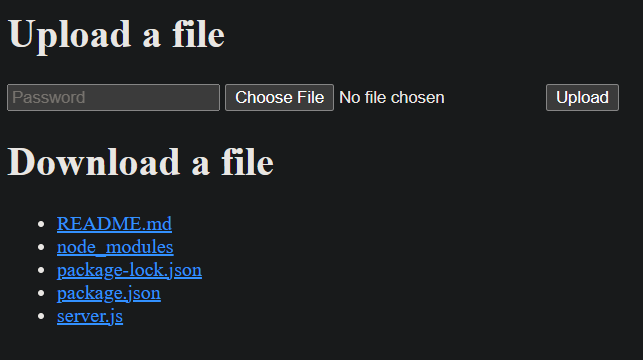

# gptShare
gptShare is a NodeJS command line tool that creates a server which allows a remote user to upload and download files directly to and from the local disk. The app provides a simple web UI for the remote user and requires a password for both uploads and downloads.

> It's important to note that gptShare was written mostly by chatGPT, a chatbot trained by OpenAI. While chatGPT was able to provide guidance and examples on how to write the code, human programmers were responsible for implementing and testing the code.
> 
> gptShare is intended to be an example of how chatGPT can assist in software development and should not be used in any real-life situations. It is not production-ready and may contain bugs or vulnerabilities. Use at your own risk.
> 
> It's also important to note that the entirety of the documentation for gptShare was written by chatGPT, a chatbot trained by OpenAI. While chatGPT was able to provide accurate and helpful information, it is a machine learning model and may make errors or omissions.
> 
> The documentation was compiled and formatted by a human, but the content was generated by chatGPT. Please keep this in mind when using the documentation.

**Authors Note: I would estimate that roughly 95-98% of the content in this repository was generated by chatGPT.**

## Chat Log
Checkout the [LOG.md](LOG.md) file for the full chatGPT log!

## UI Screenshot


## Installation
To install gptShare, run the following command:

```
npm install -g gptShare
```

## Usage
To start the gptShare server, run the following command:
```
gptShare
```

The server will start and listen for connections on port 3000 by default. You can specify a different port with the --port flag:

```
gptShare --port 8080
```

The default directory for uploads and downloads is the current working directory. You can specify a different directory with the --dir flag:


```
gptShare --dir /path/to/directory
```

You can also specify the password required for uploads and downloads with the --password flag:

```
gptShare --password mypassword
```

To access the web UI, open a web browser and navigate to http://localhost:3000 (or the port specified with the --port flag). From the web UI, you can upload and download files using the password specified with the --password flag.

## About
gptShare was written mostly by chatGPT, a chatbot trained by OpenAI. chatGPT was able to assist in writing the code and provide guidance on how to structure the app, but human programmers were responsible for implementing the code and testing it.

During the development of gptShare, chatGPT was able to provide guidance on the overall structure and design of the app. It suggested using the express library for the server and web UI, and the fs library for reading and writing files. It also suggested using the multer library for handling file uploads.

chatGPT was able to provide examples of how to use these libraries and explain the various options and configurations available. It also provided suggestions on how to handle errors and edge cases, and how to structure the code for ease of maintenance and extension.

Overall, chatGPT was a valuable resource in the development of gptShare and was able to provide helpful insights and recommendations throughout the process.